# 스튜디오 지브리 영화의 명장면 감상평 서비스

이 프로젝트는 **GraphQL** 학습을 목적으로 제작된 웹 서비스입니다.  
REST API의 오버페칭/언더페칭 문제 해결을 위해 GraphQL을 도입했고, Apollo Server + Express를 기반으로 구현.  
_GraphQL과 타입스크립트로 개발하는 웹 서비스_ (저자: 강화수)에서 제공하는 [🔗예제 프로젝트](https://github.com/hwasurr/graphql-book-fullstack-project)를 클론.

## 기술스택

[](https://graphql.org/)  
[](https://www.apollographql.com/)
[](https://expressjs.com/ko/)
[](https://www.mysql.com/)
[](https://redis.io/)
[](https://typeorm.io/)  
[](https://reactjs.org)
[](https://chakra-ui.com/)  
[](https://www.typescriptlang.org/)
[](https://eslint.org/)
[](https://prettier.io/)

## 스크린샷

|  |  |
| --------------------------------------------------------------------------------------------- | ----------------------------------------------------------------------------------------------- |
|      |        |

## 다이어그램

### Entity Relationship Diagram

```mermaid
erDiagram
    direction LR

    FILM {
        int id PK
        int director_id FK
        string title
        string subtitle
        string genre
        int runningTime
        string description
        string posterImg
        string release
    }

    CUT {
        int id PK
        int filmId FK
        string src
    }

    CUT_REVIEW {
        int id PK
        int cutId FK
        int userId FK
        string contents
        datetime createdAt
        datetime updatedAt
    }

    CUT_VOTE {
        int userId PK, FK
        int cutId PK, FK
    }

    USER {
        int id PK
        string username
        string email
        string password
        string profileImage
        datetime createdAt
        datetime updatedAt
    }

    DIRECTOR {
        int id PK
        string name
    }

    %% 관계 ì •ì˜
    DIRECTOR ||--o{ FILM : "directs"

    FILM ||--o{ CUT : "has"

    USER ||--o{ CUT_REVIEW : "writes"
    USER ||--o{ CUT_VOTE : "votes"

    CUT ||--o{ CUT_REVIEW : "has"
    CUT ||--o{ CUT_VOTE : "has"
```



| 테이블         | 설명                                                               | 관계                            |
| -------------- | ------------------------------------------------------------------ | ------------------------------- |
| **FILM**       | 영화 정보 테이블 (제목, 감독, 장르, 상영시간, 포스터, 개봉년도 등) |
| **CUT**        | 영화의 명장면 테이블 (영화ID, 사진URL)                             | FILM과 1:N 관계                 |
| **CUT_REVIEW** | 명장면 감상평 테이블 (명장면ID, 사용자ID, 감상평)                  | CUT과 USER와 각각 N:1 관계      |
| **CUT_VOTE**   | 명장면 투표 저장 테이블 (명장면ID, 사용자ID)                       | CUT과 USER의 다대다 관계 테이블 |
| **USER**       | 사용자 정보 테이블 (유저이름, 비밀번호)                            |
| **DIRECTOR**   | 감독 정보 테이블                                                   |

## 실행 방법

### 서버

#### 환경변수 설정 (/project/server/.env)

```dotenv
MYSQL_HOST=localhost
MYSQL_PORT=3306
MYSQL_DATABASE=ghibli_graphql
MYSQL_USERNAME=root
MYSQL_PASSWORD=pswd
MYSQL_ROOT_PASSWORD=pswd

JWT_SECRET_KEY=secret-key
JWT_REFRESH_SECRET_KEY=refresh-key

DOMAIN=http://localhost:3000
PORT=4000

REDIS_HOST=localhost
REDIS_PORT=6379
```

#### 컨테이너 및 로컬 서버 실행

```sh
$ cd project/server
$ export $(cat .env | xargs)

# mysql 실행
$ docker run -d \
  --name mysql-container \
  --env-file ./.env \
  -p ${MYSQL_PORT}:3306 \
  mysql:latest

# redis 실행
$ docker run -d \
  --name redis-container \
  --env-file ./.env \
  -p ${REDIS_PORT}:6379 \
  redis:latest

# 서버 실행
$ npm run dev
```

### 클라이언트

#### 환경변수 설정 (/project/web/.env)

```dotenv
REACT_APP_API_HOST=http://localhost:4000
PORT=3000
```

#### 프론트엔드 개발 서버 실행

```sh
$ cd project/web

$ npm run start
```
