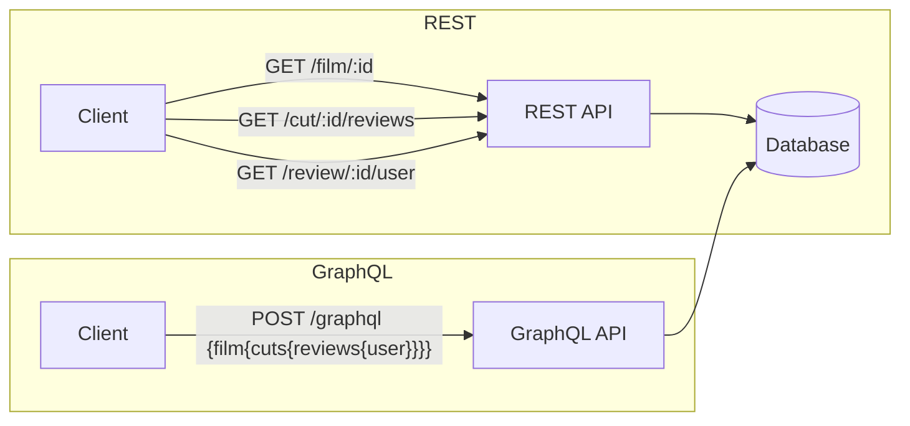

# 스튜디오 지브리 영화의 명장면 감상평 서비스

**GraphQL** 학습을 목적으로 제작된 웹 서비스.
REST API의 오버페칭/언더페칭 문제를 해결하기 위해 GraphQL을 도입하고, Apollo + Express를 기반으로 구현.  
또한, Elastic Stack(Elasticsearch, Logstash, Kibana) 을 도입하여 MySQL 데이터를 실시간으로 동기화하고,  
Elasticsearch 기반의 고성능 검색 기능과 Kibana를 통한 데이터 시각화 및 분석 환경을 제공.

_GraphQL과 타입스크립트로 개발하는 웹 서비스_ (저자: 강화수)에서 제공하는 [🔗예제 프로젝트](https://github.com/hwasurr/graphql-book-fullstack-project)를 바탕으로 함.

## 기술스택

[](https://graphql.org/)  
[](https://www.apollographql.com/)
[](https://expressjs.com/ko/)
[](https://www.elastic.co/elastic-stack)
[](https://www.mysql.com/)
[](https://redis.io/)
[](https://typeorm.io/)  
[](https://www.elastic.co/kr/elasticsearch)
[](https://www.elastic.co/kr/logstash)
[](https://www.elastic.co/kr/kibana)  
[](https://reactjs.org)
[](https://chakra-ui.com/)  
[](https://nodejs.org/ko/)
[](https://www.typescriptlang.org/)
[](https://eslint.org/)
[](https://prettier.io/)  
[![docker-compose](https://img.shields.io/badge/Docker_Compose-2AB4FF.svg?logo=data:image/svg+xml;base64,PHN2ZyB4bWxucz0iaHR0cDovL3d3dy53My5vcmcvMjAwMC9zdmciIHZpZXdCb3g9IjAgMCA1MjMgNjY1Ij4KICA8cGF0aCBmaWxsPSIjZmNmY2ZjIiBmaWxsLXJ1bGU9ImV2ZW5vZGQiIGQ9Ik00MTggMWMtNiAxLTkgMy0xMyA4LTQgMy00IDMtMTAgMS0xMi02LTYwIDAtNjYgOC01IDYtMTEgNDQtOCA1MGwyMyAxN2M3IDQgNyA2IDIgNy0yMyAzLTM3IDI5LTI5IDUyIDMgOSAzIDktMTAgNi0xOS01LTI0LTYtNDUtNS00NyAwLTg2IDE4LTEwOSA1MGExMzUgMTM1IDAgMCAwLTI0IDY0Yy0zIDI4IDIgNDggMTcgNzJsMjIgMjdjNDAgNDQgNDEgNjYgMyA5MS00NSAzMC0xMDQgMTktMTA2LTIwLTEtMTYgNC0yOSAxNy01MiAxMy0yNCAxNC0zMyAzLTUybDEzLThjMjQtMTIgMjItOSAyMy0zNCAwLTIyIDItMjAtMjMtMzAtMTgtNi0yMC02LTQwLTEtMjggOS00MCAxNC00MSAxOCAwIDItMSAzLTIgMy03IDAtMTQgMTItMTUgMjUtMSAyMSA2IDI5IDMwIDM2IDMwIDkgMzUgMjQgMTkgNDktMzYgNTMtMzIgMTAyIDExIDEyMSAzNSAxNiA3NCAxMyAxMTktOWwxMS01IDMgMzJjMCAzNC00MCAzOC04OSA4bC0xNi0xMGMtNTEtMjktMTAyIDI0LTY2IDcwIDE1IDIwIDQyIDIxIDQ2IDIgMi04IDAtMTEtMTAtMTktMTYtMTItMTctMjQtMi0yNyA1LTEgMjYgOCAyOCAxMmwzNCAyOSAyMCAxMiAyMCA4YzM2IDEzIDgyLTE1IDgyLTUwIDAtMTAgMC0xMCA2LTUgMTAgMTAgMTggMTYgMjMgMTkgNiAzIDYgNCAxIDctNSAyLTUgMi01IDctMSA4IDEgMjkgNCAzMyA0IDcgNjMgNDYgNjkgNDYgMyAwIDQ4LTI1IDUxLTI5IDItMSAzLTM0IDEtMzZsLTE2LTljLTE2LTgtMTYtOC05LTEwIDE5LTcgMzctMjcgNDMtNDdsNS0xYTE2NSAxNjUgMCAwIDAgNjAtMTNjOSAwIDM0LTIyIDQwLTM0bDQtOGM0LTcgNi0yNiA2LTU2IDAtMjkgMS0yNy0xMC0yOS02LTItOC0zLTEzLTgtMzAtMjktNzktMjMtOTYgMTAtMyA3LTMgNy04IDlzLTYgNS01IDE3djE1YzEgMTQgNCAxNiAzNCAyOGwxMiA2YzcgMyA3IDMgMzAtNyA4LTMgOS0zIDkgMS02IDIyLTY0IDQyLTczIDI0YTg3IDg3IDAgMCAwLTYzLTQyYy04IDAtOCAwIDYtMTFhNzM2IDczNiAwIDAgMCA4NS04OWwzLTVjMTktMzEgMjEtNzMgMy0xMDctNy0xNS0yMy0zNS0zNi00OC0zOS0zNi00Ni00Ny0zOC02MiA0LTggMTUtMTcgMjAtMTVhNDUyIDQ1MiAwIDAgMCA1NS0xMmMxMS00IDEzLTUgMTQtMTAgMC00IDItNyA5LTE0IDI0LTI2LTgtODAtNDMtNzFNMjI4IDMzNGMxIDEgMCAxLTEgMS0yMCAwLTI4IDMyLTEyIDQyIDE3IDkgMzctMyAzNy0yMiAwLTctNy0xNy0xMS0xN3YtMWMzLTIgMC0zLTctNGwtNiAxbTU0IDgtNCAxYy0yMiAzLTI1IDM5LTMgNDQgMjQgNSA0MS0yMSAyNS0zOGwtNS0zdi0zYy0xLTItMTQtMy0xMy0xbS00OSAxMjBjLTYgNy05IDE0LTkgMjQgMCA4IDEgMTIgMyA2IDItMTIgOC0yOCAxMy0zM3YtM2MtMSAwLTQgMi03IDZtOTcgNGMwIDIgMjMgMTcgMjcgMTcgMiAwIDEtMy00LTctOS03LTIzLTEzLTIzLTEwbS01NCA2Yy0yMSA1MSAyOSA5NiA3MyA2NyA4LTYgOC03LTEtOC0zOS0zLTYzLTIzLTY2LTU0LTItMTItMy0xMy02LTUiLz4KPC9zdmc+Cg==&style=flat&logoColor=black)](https://docs.docker.com/compose/)
[](https://www.docker.com/)
[](https://nginx.org/)

## 스크린샷

|  |  |
| --------------------------------------------------------------------------------------------- | ----------------------------------------------------------------------------------------------- |
|     |        |
|     |        |

## 다이어그램

### Architecture Diagram


- 백엔드
    - **Apollo Server**: Express 플러그인으로 GraphQL query, mutation, resolver 처리
    - **Express**: 웹 서버 및 미들웨어 관리
    - **비즈니스 로직**: 클라이언트 요청을 받아 MySQL과 Redis에 데이터 저장 및 캐싱
    - **MySQL**: 영속적 데이터 저장 (영화, 명장면, 감상평)
    - **Redis**: 캐싱 및 성능 최적화
    - **Elasticsearch**: 검색 엔진, 영화 데이터에 대한 텍스트 검색 지원
    - **Logstash**: 데이터 파이프라인, MySQL에서 Elasticsearch로 동기화
    - **Kibana**: Elasticsearch 데이터를 시각화, 검색/로그 분석 및 모니터링 대시보드 제공
- 프론트엔드
    - **Apollo Client**: GraphQL 쿼리/뮤테이션 전송, 클라이언트 캐싱, 데이터 페칭
    - **React**: UI 렌더링 및 상태 관리
    - **Chakra UI**: 웹 UI 구성 및 스타일링
- 데이터 흐름
    1. 클라이언트(React)에서 Apollo Client로 GraphQL 요청 전송
    2. Apollo Server + Express에서 요청 처리 후 비즈니스 로직 실행
    3. MySQL/Elasticsearch/Redis에서 필요한 데이터 조회 또는 저장
        1. MySQL에 저장된 데이터는 Logstash 파이프라인을 통해 수집·정제되어 Elasticsearch로 동기화
    4. 서버에서 처리된 데이터를 GraphQL Response로 클라이언트에 반환

### GraphQL Schema Diagram

> GraphQL Voyager는 GraphQL 스키마를 시각적으로 탐색하고 구조를 이해할 수 있도록 돕는 정적/인터랙티브 시각화 도구  
> 타입과 타입 간 참조를 그래프 형태로 표현

| [](https://narcisource.github.io/Ghibli-Films/) |
| ------------------------------------------------------------------------------------------------------------------------------------------ |
| [GraphQL Voyager 바로가기](https://narcisource.github.io/Ghibli-Films/)                                                                    |


### Entity Relationship Diagram


| 테이블         | 설명                                                               | 관계                            |
| -------------- | ------------------------------------------------------------------ | ------------------------------- |
| **FILM**       | 영화 정보 테이블 (제목, 감독, 장르, 상영시간, 포스터, 개봉년도 등) |
| **CUT**        | 영화의 명장면 테이블 (영화ID, 사진URL)                             | FILM과 1:N 관계                 |
| **CUT_REVIEW** | 명장면 감상평 테이블 (명장면ID, 사용자ID, 감상평)                  | CUT과 USER와 각각 N:1 관계      |
| **CUT_VOTE**   | 명장면 투표 저장 테이블 (명장면ID, 사용자ID)                       | CUT과 USER의 다대다 관계 테이블 |
| **USER**       | 사용자 정보 테이블 (유저이름, 비밀번호)                            |
| **DIRECTOR**   | 감독 정보 테이블                                                   |

### Comparison Flowchart



| REST                                      | GraphQL                                                    |
| ----------------------------------------- | ---------------------------------------------------------- |
| 여러 엔드포인트 호출 필요                 | 단일 엔드포인트(/graphql)에서 요청 처리                    |
| 오버페칭/언더페칭 발생                    | 클라이언트가 원하는 데이터 구조를 직접 정의                |
| 요청 횟수가 늘어나 네트워크 효율 하락     | 한 번의 요청으로 필요한 데이터만 가져와 응답 사이즈를 감소 |
| 역방향 탐색을 하려면 별도 엔드포인트 필요 | 그래프 모델 기반으로 양방향 탐색의 자유로움                |

GraphQL 쿼리 예시

```js
{
  film(id: 1) {
    title
    cuts {
      votesCount
      reviews {
        contents
        user {
          username
          email
        }
      }
    }
  }
}
```

</details>

## 실행 방법

```sh
$ docker-compose up -d
```

## 접속 안내

| 환경               | URL                              |
| ------------------ | -------------------------------- |
| web                | <http://localhost:3000>          |
| server healthcheck | <http://localhost:4000>          |
| graphql schema     | <http://localhost:4000/voyager>⁠ |
| graphql playground | <http://localhost:4000/graphql>⁠ |
| elasticsearch ui   | <http://localhost:5601>⁠         |
