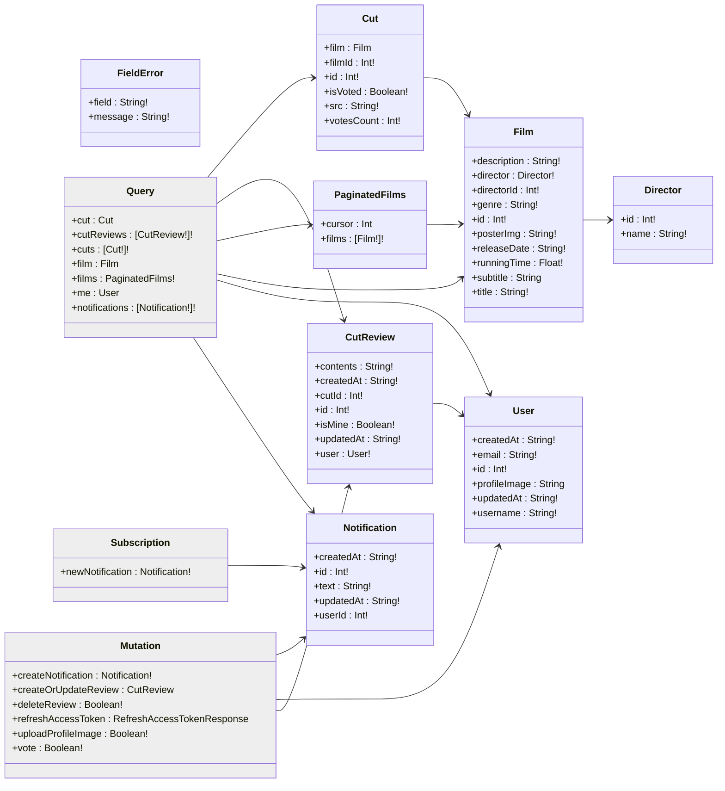
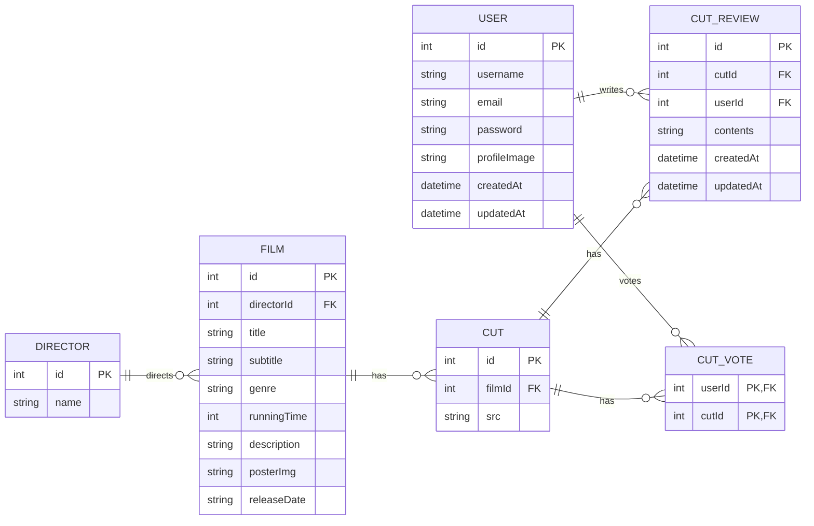
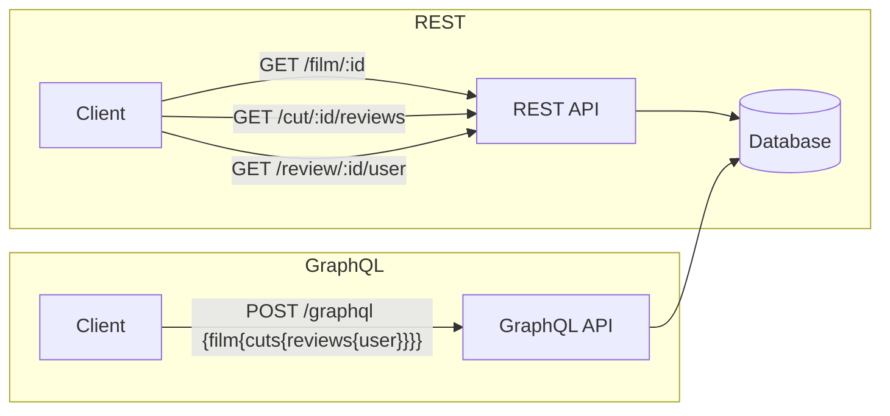

## 다이어그램

### GraphQL Schema Diagram

> GraphQL Voyager는 GraphQL 스키마를 시각적으로 탐색하고 구조를 이해할 수 있도록 돕는 정적/인터랙티브 시각화 도구  
> 타입과 타입 간 참조를 그래프 형태로 표현

| [](https://narcisource.github.io/Ghibli-Films/) |
| ------------------------------------------------------------------------------------------------------------------------------------------ |
| [GraphQL Voyager 바로가기](https://narcisource.github.io/Ghibli-Films/)                                                                    |


```mermaid
classDiagram
    direction LR

    %% 타입 %%
    class Cut {
      +film : Film
      +filmId : Int!
      +id : Int!
      +isVoted : Boolean!
      +src : String!
      +votesCount : Int!
    }
    class CutReview {
      +contents : String!
      +createdAt : String!
      +cutId : Int!
      +id : Int!
      +isMine : Boolean!
      +updatedAt : String!
      +user : User!
    }
    class Director {
      +id : Int!
      +name : String!
    }
    class FieldError {
      +field : String!
      +message : String!
    }
    class Film {
      +description : String!
      +director : Director!
      +directorId : Int!
      +genre : String!
      +id : Int!
      +posterImg : String!
      +releaseDate : String!
      +runningTime : Float!
      +subtitle : String
      +title : String!
    }
    class Mutation:::root {
      +createNotification : Notification!
      +createOrUpdateReview : CutReview
      +deleteReview : Boolean!
      +refreshAccessToken : RefreshAccessTokenResponse
      +uploadProfileImage : Boolean!
      +vote : Boolean!
    }
    class Notification {
      +createdAt : String!
      +id : Int!
      +text : String!
      +updatedAt : String!
      +userId : Int!
    }
    class PaginatedFilms {
      +cursor : Int
      +films : [Film!]!
    }
    class Query:::root {
      +cut : Cut
      +cutReviews : [CutReview!]!
      +cuts : [Cut!]!
      +film : Film
      +films : PaginatedFilms!
      +me : User
      +notifications : [Notification!]!
    }
    class Subscription:::root {
      +newNotification : Notification!
    }
    class User {
      +createdAt : String!
      +email : String!
      +id : Int!
      +profileImage : String
      +updatedAt : String!
      +username : String!
    }

    %% 관계 %%
    Cut --> Film
    CutReview --> User
    Film --> Director
    PaginatedFilms --> Film
    Query --> Cut
    Query --> CutReview
    Query --> PaginatedFilms
    Query --> Film
    Query --> User
    Query --> Notification
    Mutation --> Notification
    Mutation --> User
    Mutation --> CutReview
    Subscription --> Notification

    %% 스타일링 %%
    classDef root fill:#EEE
```

### Entity Relationship Diagram


```mermaid
erDiagram
    direction LR

    FILM {
        int id PK
        int directorId FK
        string title
        string subtitle
        string genre
        int runningTime
        string description
        string posterImg
        string releaseDate
    }

    CUT {
        int id PK
        int filmId FK
        string src
    }

    CUT_REVIEW {
        int id PK
        int cutId FK
        int userId FK
        string contents
        datetime createdAt
        datetime updatedAt
    }

    CUT_VOTE {
        int userId PK, FK
        int cutId PK, FK
    }

    USER {
        int id PK
        string username
        string email
        string password
        string profileImage
        datetime createdAt
        datetime updatedAt
    }

    DIRECTOR {
        int id PK
        string name
    }

    %% 관계 정의
    DIRECTOR ||--o{ FILM : "directs"

    FILM ||--o{ CUT : "has"

    USER ||--o{ CUT_REVIEW : "writes"
    USER ||--o{ CUT_VOTE : "votes"

    CUT ||--o{ CUT_REVIEW : "has"
    CUT ||--o{ CUT_VOTE : "has"
```

| 테이블         | 설명                                                               | 관계                            |
| -------------- | ------------------------------------------------------------------ | ------------------------------- |
| **FILM**       | 영화 정보 테이블 (제목, 감독, 장르, 상영시간, 포스터, 개봉년도 등) |
| **CUT**        | 영화의 명장면 테이블 (영화ID, 사진URL)                             | FILM과 1:N 관계                 |
| **CUT_REVIEW** | 명장면 감상평 테이블 (명장면ID, 사용자ID, 감상평)                  | CUT과 USER와 각각 N:1 관계      |
| **CUT_VOTE**   | 명장면 투표 저장 테이블 (명장면ID, 사용자ID)                       | CUT과 USER의 다대다 관계 테이블 |
| **USER**       | 사용자 정보 테이블 (유저이름, 비밀번호)                            |
| **DIRECTOR**   | 감독 정보 테이블                                                   |

### Comparison Flowchart


```mermaid
flowchart LR
    subgraph REST
        rest_client[Client] -->|GET /film/:id| rest_api[REST API]
        rest_client -->|GET /cut/:id/reviews| rest_api
        rest_client -->|GET /review/:id/user| rest_api
        rest_api --> db[(Database)]
    end

    subgraph GraphQL
        graph_client[Client] -->|"POST /graphql {film{cuts{reviews{user}}}}"| graph_api[GraphQL API]
        graph_api --> db
    end
```

| REST                                      | GraphQL                                                    |
| ----------------------------------------- | ---------------------------------------------------------- |
| 여러 엔드포인트 호출 필요                 | 단일 엔드포인트(/graphql)에서 요청 처리                    |
| 오버페칭/언더페칭 발생                    | 클라이언트가 원하는 데이터 구조를 직접 정의                |
| 요청 횟수가 늘어나 네트워크 효율 하락     | 한 번의 요청으로 필요한 데이터만 가져와 응답 사이즈를 감소 |
| 역방향 탐색을 하려면 별도 엔드포인트 필요 | 그래프 모델 기반으로 양방향 탐색의 자유로움                |

GraphQL 쿼리 예시

```js
{
  film(id: 1) {
    title
    cuts {
      votesCount
      reviews {
        contents
        user {
          username
          email
        }
      }
    }
  }
}
```

## 폴더 구조

<details>
<summary>열기</summary>

```
server
├─ README.md
├─ .env # 환경변수
├─ .babelrc # 트랜스컴파일러
├─ biome.json # 린터, 포맷터 통합
├─ package.json # 패키지 의존성 관리
├─ tsconfig.json # ts 컴파일러 설정
├─ codegen.yml # 스키마 파일저장
├─ Dockerfile # 도커파일
├─ graphql # GraphQL 스키마
│  ├─ anonymousSchema.graphql
│  └─ authenticatedSchema.graphql
└─ src
   ├─ index.ts
   ├─ express # 익스프레스 서버 설정
   │  └─ createExpressApp.ts
   ├─ apollo # 아폴로 서버 설정
   │  ├─ index.ts
   │  ├─ context # 컨텍스트 타입 정의
   │  │  ├─ IContext.ts
   │  │  └─ WsContext.ts
   │  ├─ schema
   │  │  └─ createSchema.ts # 리졸버 스키마 생성
   │  ├─ server
   │  │  ├─ setupApollo.ts # graphql 서버 구성
   │  │  ├─ mountApolloServer.ts
   │  │  ├─ createApolloServer.ts
   │  │  └─ registerMiddlewares.ts
   │  └─ subscription
   │     ├─ createSubscriptionServer.ts # graphql-ws 서버 구성
   │     └─ pubSub.ts # 구독 알림 이벤트
   ├─ auth
   │  ├─ IdToken.ts # ID토큰 타입
   │  ├─ IdentityInput.ts # 토큰 데이터 타입
   │  ├─ resolveIdentityFromRequest.ts # 토큰 분석
   │  └─ resolveVerifiedUser.ts # 계정 연동
   ├─ db # 데이터베이스 구성
   │  ├─ db-client.ts
   │  ├─ es-client.ts
   │  └─ redis-client.ts
   ├─ entities # 엔터티 모델
   │  ├─ User.ts
   │  ├─ User.Error.ts
   │  ├─ Film.ts
   │  ├─ PaginatedFilm.ts
   │  ├─ Cut.ts
   │  ├─ CutReview.ts
   │  ├─ CutVote.ts
   │  ├─ Director.ts
   │  └─ Notification.ts
   ├─ dataloaders # 요청 단위 쿼리 배치
   │  ├─ createLoader.ts
   │  └─ cutVoteLoader.ts
   ├─ resolvers # GraphQL 리졸버
   │  ├─ fields
   │  │  ├─ Film.ts
   │  │  ├─ Cut.ts
   │  │  └─ CutReview.ts
   │  ├─ anonymous
   │  │  ├─ index.ts
   │  │  ├─ film
   │  │  │  ├─ FilmQuery.ts
   │  │  │  └─ FilmsQuery.ts
   │  │  ├─ cut
   │  │  │  ├─ CutQuery.ts
   │  │  │  └─ CutsQuery.ts
   │  │  └─ cutReview
   │  │     ├─ type.ts
   │  │     └─ CutReviewQuery.ts
   │  └─ authenticated
   │     ├─ index.ts
   │     ├─ user
   │     │  ├─ MeQuery.ts
   │     │  ├─ MyReviewsQuery.ts
   │     │  └─ UploadProfileImageMutation.ts
   │     ├─ cut
   │     │  └─ VoteMutation.ts
   │     ├─ cutReview
   │     │  ├─ type.ts
   │     │  ├─ CreateOrUpdateMutation.ts
   │     │  └─ DeleteMutation.ts
   │     └─ notification
   │        ├─ NotificationQuery.ts
   │        ├─ NotificationMutation.ts
   │        └─ NotificationSubscription.ts
   └─ utils
      └─ parseBearerToken.ts
```

</details>
